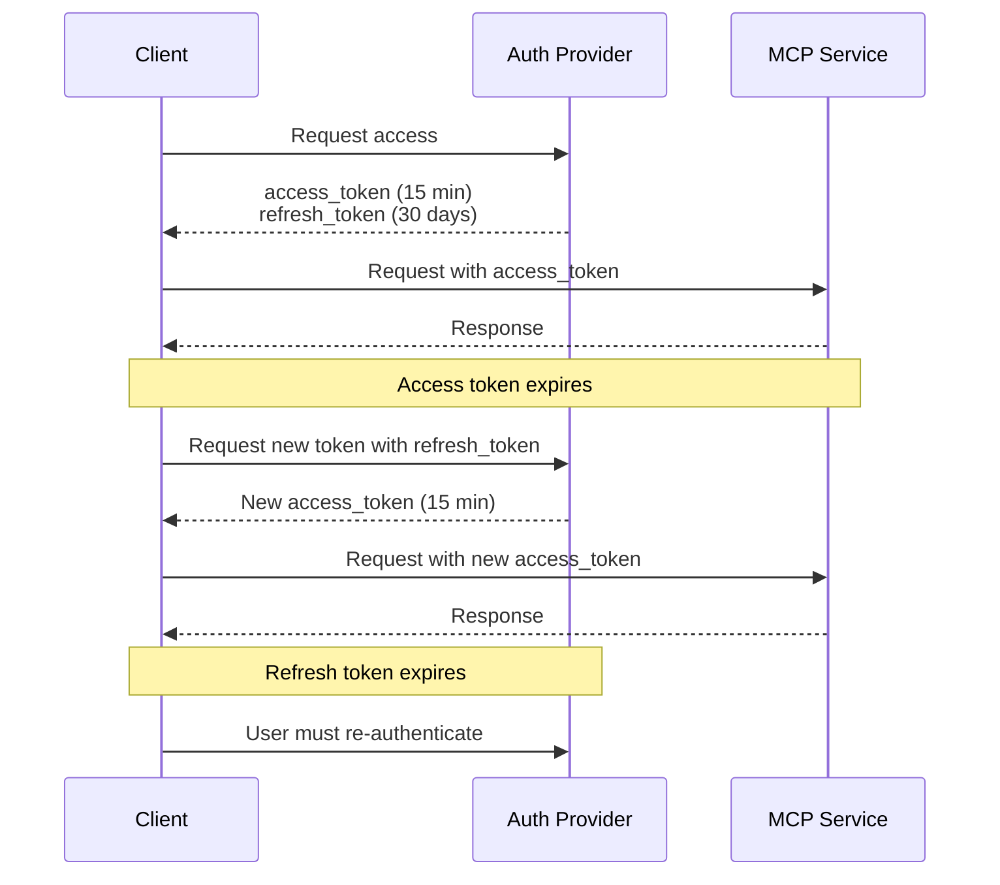
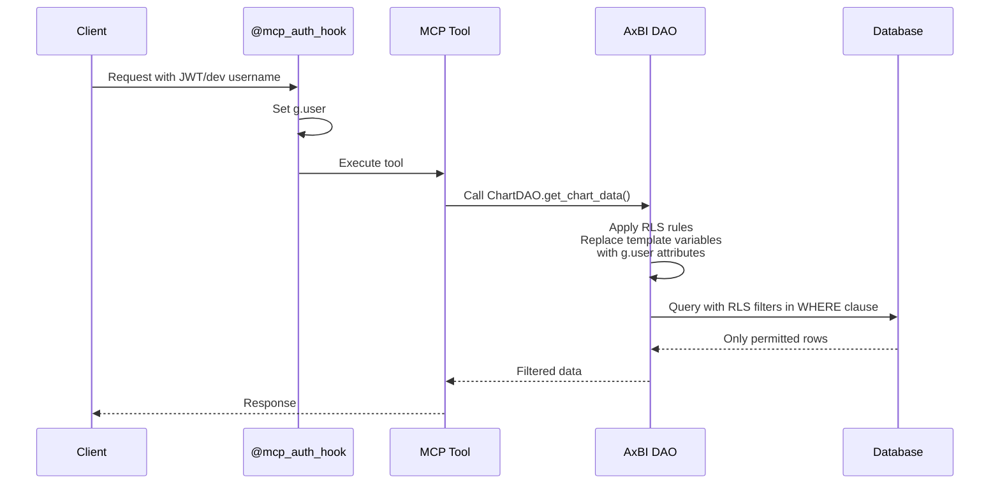
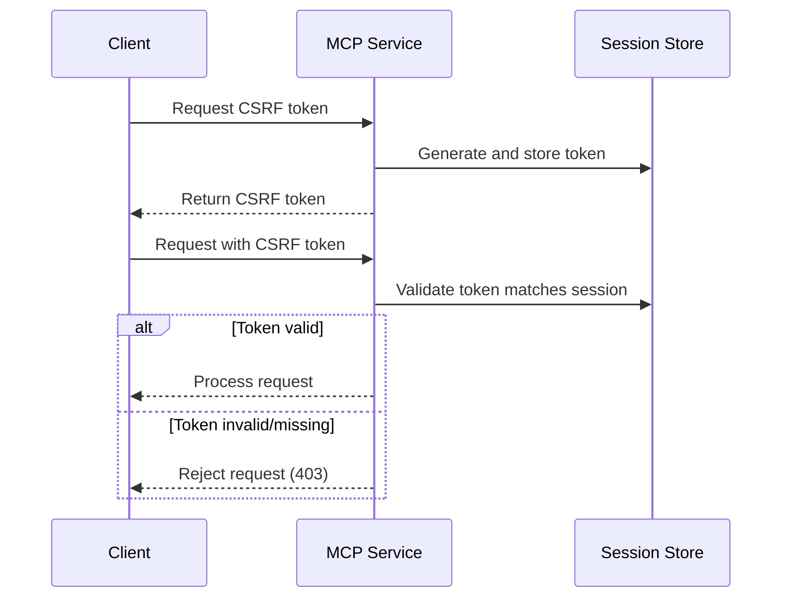

<!--
Licensed to the Apache Software Foundation (ASF) under one
or more contributor license agreements.  See the NOTICE file
distributed with this work for additional information
regarding copyright ownership.  The ASF licenses this file
to you under the Apache License, Version 2.0 (the
"License"); you may not use this file except in compliance
with the License.  You may obtain a copy of the License at

  http://www.apache.org/licenses/LICENSE-2.0

Unless required by applicable law or agreed to in writing,
software distributed under the License is distributed on an
"AS IS" BASIS, WITHOUT WARRANTIES OR CONDITIONS OF ANY
KIND, either express or implied.  See the License for the
specific language governing permissions and limitations
under the License.
-->

# MCP Service Security

## Overview

The MCP service implements multiple layers of security to ensure safe programmatic access to AxBI functionality. This document covers authentication, authorization, session management, audit logging, and compliance considerations.

## Authentication

### Default User API Key Authentication

AX BI enables FAB API-key authentication for MCP by default. When the
authenticated navbar loads, it creates one dedicated `AX BI MCP` key if the
user does not already have one. Its plaintext creation response is discarded;
the navbar retains only a non-secret display hint. Clicking the eye action
creates a replacement, copies its one-time plaintext, and only then revokes the
previous dedicated key. If copying fails, the replacement is revoked and the
previous key remains usable.

API keys are stored as salted hashes and are bound to their owner. The stored
display hint contains seven leading and nine trailing characters from the
random key body. The UI renders it as
`M8hayd7-**********-iay8hfdsG`; the middle mask is presentation-only and the
hint cannot authenticate a request. MCP requests must send the full key on
every request:

```http
Authorization: Bearer <api-key>
```

The request uses the owner's current FAB roles, datasource access, object ACLs,
and RLS rules at request time. Revoking the key invalidates it without changing
the user's password, browser sessions, or other keys. The management endpoints
filter every list/get/revoke operation by authenticated owner, and Public users
receive no API-key management permission.

Run `ax-bi init` after enabling or upgrading the feature so the built-in Admin,
Alpha, and Gamma roles receive `can_create`, `can_get`, `can_list`, and
`can_revoke` on `ApiKey`. Custom roles must be granted those permissions
explicitly. Operators using only an external JWT/OIDC provider may set both
`FAB_API_KEY_ENABLED = False` and `MCP_API_KEY_ENABLED = False`.

The optional `scopes` field on a FAB API key is metadata; MCP authorization for
these keys is driven by the owner's FAB roles and ACLs. `MCP_REQUIRED_SCOPES`
applies to scoped JWTs, not FAB API keys.

### Current Implementation (Development)

For development and testing, the MCP service uses a simple username-based authentication:

```python
# axbi_config.py
MCP_DEV_USERNAME = "admin"
```

**How it works**:
1. The `@mcp_auth_hook` decorator clears any stale `g.user` and calls `get_user_from_request()`
2. `get_user_from_request()` resolves the user in priority order:
   - **JWT auth context** (per-request ContextVar from MCP SDK) — safest, prevents stale user impersonation
   - **FAB API key** — validates the key and loads its owner
   - **`MCP_DEV_USERNAME`** from config — for development/single-user deployments
   - **`g.user` fallback** — for external middleware (e.g., Preset's WorkspaceContextMiddleware)
3. User is queried from database (with roles/groups eagerly loaded) and set as `g.user`
4. All subsequent AxBI operations use this user's permissions

**Development Use Only**:
- No token validation
- No multi-user support
- No authentication security
- Single user for all MCP requests
- NOT suitable for production

### Optional Centralized Identity (JWT)

For deployments with a centralized identity provider, the MCP service also
supports JWT (JSON Web Token) authentication. JWT and FAB API-key validation
may be enabled together:

```python
# axbi_config.py
MCP_AUTH_ENABLED = True
MCP_JWT_ISSUER = "https://your-auth-provider.com"
MCP_JWT_AUDIENCE = "ax-bi-mcp"
MCP_JWT_ALGORITHM = "RS256"  # or "HS256" for symmetric keys

# Option 1: Use JWKS endpoint (recommended for RS256)
MCP_JWKS_URI = "https://your-auth-provider.com/.well-known/jwks.json"

# Option 2: Use static public key (RS256)
MCP_JWT_PUBLIC_KEY = """-----BEGIN PUBLIC KEY-----
MIIBIjANBgkqhkiG9w0BAQEFAAOCAQ8AMIIBCgKCAQEA...
-----END PUBLIC KEY-----"""

# Option 3: Use shared secret (HS256 - less secure)
MCP_JWT_ALGORITHM = "HS256"
MCP_JWT_SECRET = "your-shared-secret-key"
```

**JWT Token Structure**:

```json
{
  "iss": "https://your-auth-provider.com",
  "sub": "user@company.com",
  "aud": "ax-bi-mcp",
  "exp": 1735689600,
  "iat": 1735686000,
  "email": "user@company.com",
  "scopes": ["axbi:read", "axbi:chart:create"]
}
```

**Required Claims**:
- `iss` (issuer): Must match `MCP_JWT_ISSUER`
- `sub` (subject): User identifier (username/email)
- `aud` (audience): Must match `MCP_JWT_AUDIENCE`
- `exp` (expiration): Token expiration timestamp
- `iat` (issued at): Token creation timestamp

**Optional Claims**:
- `email`: User's email address
- `username`: Alternative to `sub` for user identification
- `scopes`: Array of permission scopes
- `tenant_id`: Multi-tenant identifier (future use)

**Token Validation Process**:

1. Extract Bearer token from `Authorization` header
2. Verify token signature using public key or JWKS
3. Validate `iss`, `aud`, and `exp` claims
4. Check required scopes (if configured)
5. Extract user identifier from `sub`, `email`, or `username` claim
6. Look up AxBI user from database
7. Set `g.user` for request context

**Example Client Usage**:

```bash
# Using curl
curl -H "Authorization: Bearer YOUR_JWT_TOKEN" \
     http://localhost:5008/list_charts

# Using MCP client (Claude Desktop)
{
  "mcpServers": {
    "axbi": {
      "url": "http://localhost:5008",
      "headers": {
        "Authorization": "Bearer YOUR_JWT_TOKEN"
      }
    }
  }
}
```

### Token Renewal and Refresh

**Short-lived Access Tokens** (recommended):
- Issue tokens with short expiration (e.g., 15 minutes)
- Client must refresh token before expiration
- Reduces risk of token theft

**Refresh Token Pattern**:



**MCP Service Responsibility**:
- MCP service only validates access tokens
- Refresh token handling is the client's responsibility
- Auth provider (OAuth2/OIDC server) handles token refresh

### Service Account Patterns

For automation and batch jobs, use service accounts instead of user credentials:

```json
{
  "iss": "https://your-auth-provider.com",
  "sub": "service-account@automation.company.com",
  "aud": "ax-bi-mcp",
  "exp": 1735689600,
  "client_id": "axbi-automation",
  "scopes": ["axbi:read", "axbi:chart:create"]
}
```

**Service Account Best Practices**:
- Create dedicated AxBI users for service accounts
- Grant minimal required permissions
- Use long-lived tokens only when necessary
- Rotate service account credentials regularly
- Log all service account activity
- Use separate service accounts per automation job

**Example AxBI Service Account Setup**:

```bash
# Create service account user in AxBI
ax-bi fab create-user \
  --role Alpha \
  --username automation-service \
  --firstname Automation \
  --lastname Service \
  --email automation@company.com \
  --password <generated-password>

# Grant specific permissions
# (Use AxBI UI or FAB CLI to configure role permissions)
```

## Authorization

### RBAC Integration

The MCP service fully integrates with AxBI's Flask-AppBuilder role-based access control:

**Role Hierarchy**:
- **Admin**: Full access to all resources
- **Alpha**: Can create and edit dashboards, charts, datasets
- **Gamma**: Read-only access to permitted resources
- **Custom Roles**: Fine-grained permission sets

**Permission Checking Flow**:

```python
# In MCP tool
@mcp.tool
@mcp_auth_hook  # Sets g.user
def list_dashboards(filters: List[Filter]) -> DashboardList:
    # Flask-AppBuilder security manager automatically filters
    # based on g.user's permissions
    dashboards = DashboardDAO.find_by_ids(...)
    # Only returns dashboards g.user can access
```

**Permission Types**:

| Permission | Description | Example |
|------------|-------------|---------|
| `can_read` | View resource | View dashboard details |
| `can_write` | Edit resource | Update chart configuration |
| `can_delete` | Delete resource | Remove dashboard |
| `datasource_access` | Access dataset | Query dataset in chart |
| `database_access` | Access database | Execute SQL in SQL Lab |

### Row-Level Security (RLS)

RLS rules filter query results based on user attributes:

**RLS Rule Example**:
```sql
-- Only show records for user's department
department = '{{ current_user().department }}'
```

**How RLS Works with MCP**:



**RLS Configuration**:

RLS is configured per dataset in AxBI UI:
1. Navigate to dataset → Edit → Row Level Security
2. Create RLS rule with SQL filter template
3. Assign rule to roles or users
4. MCP service automatically applies rules (no code changes needed)

**MCP Service Guarantees**:
- Cannot bypass RLS rules
- No privileged access mode
- RLS applied consistently across all tools
- Same security model as AxBI web UI

### Dataset Access Control

The MCP service validates dataset access before executing queries:

```python
# In chart generation tool
@mcp.tool
@mcp_auth_hook
def generate_chart(dataset_id: int, ...) -> ChartResponse:
    dataset = DatasetDAO.find_by_id(dataset_id)

    # Check if user has access
    if not has_dataset_access(dataset):
        raise ValueError(
            f"User {g.user.username} does not have access to dataset {dataset_id}"
        )

    # Proceed with chart creation
    ...
```

**Dataset Access Filters**:

All listing operations automatically filter by user access:

- `list_datasets`: Uses `DatasourceFilter` - only shows datasets user can query
- `list_charts`: Uses `ChartAccessFilter` - only shows charts with accessible datasets
- `list_dashboards`: Uses `DashboardAccessFilter` - only shows dashboards user can view

**Access Check Implementation**:

```python
from axbi import security_manager

def has_dataset_access(dataset: SqlaTable) -> bool:
    """Check if g.user can access dataset."""
    if hasattr(g, "user") and g.user:
        return security_manager.can_access_datasource(datasource=dataset)
    return False
```

### Tool-Level Permissions

Different MCP tools require different AxBI permissions:

| Tool | Required Permissions | Notes |
|------|---------------------|-------|
| `list_dashboards` | `can_read` on Dashboard | Returns only accessible dashboards |
| `get_dashboard_info` | `can_read` on Dashboard + dataset access | Validates dashboard and dataset permissions |
| `list_charts` | `can_read` on Slice | Returns only charts with accessible datasets |
| `get_chart_info` | `can_read` on Slice + dataset access | Validates chart and dataset permissions |
| `get_chart_data` | `can_read` on Slice + `datasource_access` | Executes query with RLS applied |
| `generate_chart` | `can_write` on Slice + `datasource_access` | Creates new chart |
| `update_chart` | `can_write` on Slice + ownership or Admin | Must own chart or be Admin |
| `list_datasets` | `datasource_access` | Returns only accessible datasets |
| `get_dataset_info` | `datasource_access` | Validates dataset access |
| `execute_sql` | `can_sql_json` or `can_sqllab` on Database | Executes SQL with RLS |
| `generate_dashboard` | `can_write` on Dashboard + dataset access | Creates new dashboard |

**Permission Denied Handling**:

```python
# If user lacks permission, AxBI raises exception
try:
    result = DashboardDAO.find_by_id(dashboard_id)
except AxBISecurityException as e:
    raise ValueError(f"Access denied: {e}")
```

### JWT Scope Validation

Future implementation will support scope-based authorization:

```python
# axbi_config.py
MCP_REQUIRED_SCOPES = ["axbi:read"]  # Minimum scopes required
```

**Scope Hierarchy**:
- `axbi:read`: List and view resources
- `axbi:chart:create`: Create new charts
- `axbi:chart:update`: Update existing charts
- `axbi:chart:delete`: Delete charts
- `axbi:dashboard:create`: Create dashboards
- `axbi:sql:execute`: Execute SQL queries
- `axbi:admin`: Full administrative access

**Scope Enforcement** (future):

```python
@mcp.tool
@mcp_auth_hook
@require_scopes(["axbi:chart:create"])
def generate_chart(...) -> ChartResponse:
    # Only proceeds if JWT contains required scope
    ...
```

**Scope Validation Logic**:
1. Extract `scopes` array from JWT payload
2. Check if all required scopes present
3. Deny access if any scope missing
4. Log denied attempts for audit

## Session and CSRF Handling

### Session Configuration

The MCP service configures sessions for authentication context:

```python
# axbi_config.py
MCP_SESSION_CONFIG = {
    "SESSION_COOKIE_HTTPONLY": True,      # Prevent JavaScript access
    "SESSION_COOKIE_SECURE": True,        # HTTPS only (production)
    "SESSION_COOKIE_SAMESITE": "Strict",  # CSRF protection
    "SESSION_COOKIE_NAME": "axbi_session",
    "PERMANENT_SESSION_LIFETIME": 86400,  # 24 hours
}
```

**Why Session Config in MCP?**

The MCP service uses Flask's session mechanism for:
- **Authentication context**: Storing `g.user` across request lifecycle
- **CSRF token generation**: Protecting state-changing operations
- **Request correlation**: Linking related tool calls

**Important Notes**:
- MCP service is **stateless** - no server-side session storage
- Sessions used only for request-scoped auth context
- Cookies used for auth token transmission (alternative to Bearer header)
- Session data NOT persisted between MCP service restarts

### CSRF Protection

CSRF (Cross-Site Request Forgery) protection is configured but currently **not enforced** for MCP tools:

```python
MCP_CSRF_CONFIG = {
    "WTF_CSRF_ENABLED": True,
    "WTF_CSRF_TIME_LIMIT": None,  # No time limit
}
```

**Why CSRF Config Exists**:
- Flask-AppBuilder and AxBI expect CSRF configuration
- Prevents errors during app initialization
- Future-proofing for potential web UI for MCP service

**Why CSRF NOT Enforced**:
- MCP protocol uses Bearer tokens (not cookies for auth)
- CSRF attacks require browser cookie-based authentication
- Stateless API design prevents CSRF vulnerability
- MCP clients are programmatic (not browsers)

**If Using Cookie-Based Auth** (future):
- Enable CSRF token requirement
- Include CSRF token in MCP tool requests
- Validate token on state-changing operations

**CSRF Token Flow** (if enabled):



### Production Security Recommendations

**HTTPS Required**:
```python
MCP_SESSION_CONFIG = {
    "SESSION_COOKIE_SECURE": True,  # MUST be True in production
}
```

Without HTTPS:
- Cookies transmitted in plaintext
- Session hijacking risk
- JWT tokens exposed
- Man-in-the-middle attacks possible

**SameSite Configuration**:
- `Strict`: Cookies never sent cross-site (most secure)
- `Lax`: Cookies sent on top-level navigation (less secure)
- `None`: Cookies sent everywhere (requires Secure flag, least secure)

**Recommended Production Settings**:
```python
MCP_SESSION_CONFIG = {
    "SESSION_COOKIE_HTTPONLY": True,      # Always
    "SESSION_COOKIE_SECURE": True,        # Always (HTTPS required)
    "SESSION_COOKIE_SAMESITE": "Strict",  # Recommended
    "PERMANENT_SESSION_LIFETIME": 3600,   # 1 hour (adjust as needed)
}
```

## Audit Logging

### Current Logging

The MCP service logs basic authentication events:

```python
# In @mcp_auth_hook
logger.debug(
    "MCP tool call: user=%s, tool=%s",
    user.username,
    tool_func.__name__
)
```

**What's Logged**:
- User who made the request
- Which tool was called
- Timestamp (from log formatter)
- Success/failure (via exception logging)

**Log Format**:
```
2025-01-01 10:30:45,123 DEBUG [mcp_auth_hook] MCP tool call: user=admin, tool=list_dashboards
2025-01-01 10:30:45,456 ERROR [mcp_auth_hook] Tool execution failed: user=admin, tool=generate_chart, error=Permission denied
```

### Enhanced Audit Logging (Recommended)

For production deployments, implement structured logging:

```python
# axbi_config.py
import logging
import json

class StructuredFormatter(logging.Formatter):
    def format(self, record):
        log_data = {
            "timestamp": self.formatTime(record),
            "level": record.levelname,
            "logger": record.name,
            "message": record.getMessage(),
            "user": getattr(record, "user", None),
            "tool": getattr(record, "tool", None),
            "resource_type": getattr(record, "resource_type", None),
            "resource_id": getattr(record, "resource_id", None),
            "action": getattr(record, "action", None),
            "result": getattr(record, "result", None),
            "error": getattr(record, "error", None),
        }
        return json.dumps(log_data)

# Apply formatter
handler = logging.StreamHandler()
handler.setFormatter(StructuredFormatter())
logging.getLogger("axbi.mcp_service").addHandler(handler)
```

**Structured Log Example**:
```json
{
  "timestamp": "2025-01-01T10:30:45.123Z",
  "level": "INFO",
  "logger": "axbi.mcp_service.auth",
  "message": "MCP tool execution",
  "user": "admin",
  "tool": "generate_chart",
  "resource_type": "chart",
  "resource_id": 42,
  "action": "create",
  "result": "success",
  "duration_ms": 234
}
```

### Audit Events

**Key Events to Log**:

| Event | Data to Capture | Severity |
|-------|----------------|----------|
| Authentication success | User, timestamp, IP | INFO |
| Authentication failure | Username attempted, reason | WARNING |
| Tool execution | User, tool, parameters, result | INFO |
| Permission denied | User, tool, resource, reason | WARNING |
| Chart created | User, chart_id, dataset_id | INFO |
| Dashboard created | User, dashboard_id, chart_ids | INFO |
| SQL executed | User, database, query (sanitized), rows | INFO |
| Error occurred | User, tool, error type, stack trace | ERROR |

### Integration with SIEM Systems

**Export to External Systems**:

**Option 1: Syslog**:
```python
import logging.handlers

syslog_handler = logging.handlers.SysLogHandler(
    address=("syslog.company.com", 514)
)
logging.getLogger("axbi.mcp_service").addHandler(syslog_handler)
```

**Option 2: Log Aggregation (ELK, Splunk)**:
```python
# Send JSON logs to stdout, collected by log shipper
import sys
import logging

handler = logging.StreamHandler(sys.stdout)
handler.setFormatter(StructuredFormatter())
```

**Option 3: Cloud Logging (CloudWatch, Stackdriver)**:
```python
# AWS CloudWatch example
import watchtower

handler = watchtower.CloudWatchLogHandler(
    log_group="/axbi/mcp",
    stream_name="mcp-service"
)
logging.getLogger("axbi.mcp_service").addHandler(handler)
```

### Log Retention

**Recommended Retention Policies**:
- **Authentication logs**: 90 days minimum
- **Tool execution logs**: 30 days minimum
- **Error logs**: 180 days minimum
- **Compliance logs**: Per regulatory requirements (e.g., 7 years for HIPAA)

## Compliance Considerations

### GDPR (General Data Protection Regulation)

**User Data Access Tracking**:
- Log all data access by user
- Provide audit trail for data subject access requests (DSAR)
- Implement data retention policies
- Support right to be forgotten (delete user data from logs)

**MCP Service Compliance**:
- All tool calls logged with user identification
- Can generate reports of user's data access
- Logs can be filtered/redacted for privacy
- No personal data stored in MCP service (only in AxBI DB)

### SOC 2 (Service Organization Control 2)

**Audit Trail Requirements**:
- Log all administrative actions
- Maintain immutable audit logs
- Implement log integrity verification
- Provide audit log export functionality

**MCP Service Compliance**:
- Structured logging provides audit trail
- Logs include who, what, when for all actions
- Export logs to secure, immutable storage (S3, etc.)
- Implement log signing for integrity verification

### HIPAA (Health Insurance Portability and Accountability Act)

**PHI Access Logging**:
- Log all access to protected health information
- Include user, timestamp, data accessed
- Maintain logs for 6 years minimum
- Implement access controls on audit logs

**MCP Service Compliance**:
- All dataset queries logged
- Row-level security enforces data access controls
- Can identify which users accessed which PHI records
- Logs exportable for compliance reporting

**Example HIPAA Audit Log Entry**:
```json
{
  "timestamp": "2025-01-01T10:30:45.123Z",
  "user": "doctor@hospital.com",
  "action": "query_dataset",
  "dataset_id": 123,
  "dataset_name": "patient_records",
  "rows_returned": 5,
  "phi_accessed": true,
  "purpose": "Treatment",
  "ip_address": "10.0.1.25"
}
```

### Access Control Matrix

For compliance audits, maintain a matrix of who can access what:

| Role | Dashboards | Charts | Datasets | SQL Lab | Admin |
|------|-----------|--------|----------|---------|-------|
| Admin | All | All | All | All | Yes |
| Alpha | Owned + Shared | Owned + Shared | Permitted | Permitted DBs | No |
| Gamma | Shared | Shared | Permitted | No | No |
| Viewer | Shared | Shared | None | No | No |

## Security Checklist for Production

Before deploying MCP service to production:

**Authentication**:
- [ ] `MCP_API_KEY_ENABLED = True` and/or `MCP_AUTH_ENABLED = True`
- [ ] JWT issuer, audience, and keys configured
- [ ] `MCP_DEV_USERNAME` removed or set to `None`
- [ ] Token expiration enforced (short-lived tokens)
- [ ] Refresh token mechanism implemented (client-side)

**Authorization**:
- [ ] RBAC roles configured in AxBI
- [ ] RLS rules tested for all datasets
- [ ] Dataset access permissions verified
- [ ] Minimum required permissions granted per role
- [ ] Service accounts use dedicated roles

**Network Security**:
- [ ] HTTPS enabled (`SESSION_COOKIE_SECURE = True`)
- [ ] TLS 1.2+ enforced
- [ ] Firewall rules restrict access to MCP service
- [ ] Network isolation between MCP and database
- [ ] Load balancer health checks configured

**Session Security**:
- [ ] `SESSION_COOKIE_HTTPONLY = True`
- [ ] `SESSION_COOKIE_SECURE = True`
- [ ] `SESSION_COOKIE_SAMESITE = "Strict"`
- [ ] Session timeout configured appropriately
- [ ] No sensitive data stored in sessions

**Audit Logging**:
- [ ] Structured logging enabled
- [ ] All tool executions logged
- [ ] Authentication events logged
- [ ] Logs exported to SIEM/aggregation system
- [ ] Log retention policy implemented

**Monitoring**:
- [ ] Failed authentication attempts alerted
- [ ] Permission denied events monitored
- [ ] Error rate alerts configured
- [ ] Unusual access patterns detected
- [ ] Service availability monitored

**Compliance**:
- [ ] Data access logs retained per regulations
- [ ] Audit trail exportable
- [ ] Privacy policy updated for MCP service
- [ ] User consent obtained (if required)
- [ ] Security incident response plan includes MCP

## Security Incident Response

### Suspected Token Compromise

**Immediate Actions**:
1. Revoke compromised token at auth provider
2. Review audit logs for unauthorized access
3. Identify affected resources
4. Notify affected users/stakeholders
5. Force token refresh for all users (if provider supports)

**Investigation**:
1. Check MCP service logs for unusual activity
2. Correlate access patterns with compromised token
3. Determine scope of data accessed
4. Document timeline of events

### Unauthorized Access Detected

**Response Procedure**:
1. Block user/IP immediately (firewall/load balancer)
2. Disable user account in AxBI
3. Review all actions by user in audit logs
4. Assess data exposure
5. Notify security team and management
6. Preserve logs for forensic analysis

### Data Breach

**MCP-Specific Considerations**:
1. Identify which datasets were accessed via MCP
2. Determine if RLS was bypassed (should not be possible)
3. Check for SQL injection attempts (should be prevented by AxBI)
4. Review all tool executions in timeframe
5. Export detailed audit logs for incident report

## References

- **JWT Best Practices**: https://tools.ietf.org/html/rfc8725
- **OWASP API Security**: https://owasp.org/www-project-api-security/
- **AxBI Security Documentation**: https://superset.apache.org/docs/security
- **Flask-AppBuilder Security**: https://flask-appbuilder.readthedocs.io/en/latest/security.html
- **GDPR Compliance Guide**: https://gdpr.eu/
- **SOC 2 Framework**: https://www.aicpa.org/soc2
- **HIPAA Security Rule**: https://www.hhs.gov/hipaa/for-professionals/security/
